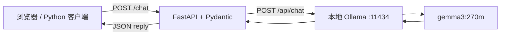

# Ollama Chat Service

使用 Python、FastAPI 和本地 Ollama 搭建的单轮对话 API。项目用于练习模型调用、HTTP 接口、输入校验、错误处理和测试。

## 功能

| 接口 | 作用 |
| --- | --- |
| `GET /health` | 检查 FastAPI 进程是否响应 |
| `GET /ready` | 检查 Ollama 可连接且配置的模型已下载 |
| `POST /chat` | 接收一条文本消息，返回模型生成的 JSON 回复 |
| `GET /docs` | 在浏览器中查看并测试接口 |

输入限于去除首尾空白后的 1–4000 个字符，模型由服务端配置。连接失败返回 503，响应超时返回 504，上游通信或响应异常返回 502，输入不合法返回 422。模型调用有 120 秒的整体超时，默认输出最多 256 个 token。

## 请求流程



本项目通过 `httpx` 直接调用 Ollama 的 HTTP API。它与 Word 教程中使用 `ollama` Python SDK 的方式完成同一类任务，便于观察请求参数、超时和 HTTP 状态码。

## 环境

- Python 3.10 或更高版本。
- Ollama 已安装并正在运行。
- 已下载 `gemma3:270m`；模型文件保存在 Ollama 的模型目录，不放在 Git 仓库中。

以下步骤以 Windows PowerShell、项目目录 `D:\Projects\ollama-chat-service` 为例。如果使用其他目录，调整 `Set-Location`。

### 1. 启动 Ollama

在一个 PowerShell 窗口中执行，并保持窗口打开：

```powershell
$env:OLLAMA_MODELS = "D:\Ollama\models"
& "D:\Ollama\ollama.exe" serve
```

如果 Ollama 已在后台运行，直接使用现有服务即可。模型尚未下载时，在另一个窗口执行：

```powershell
& "D:\Ollama\ollama.exe" pull gemma3:270m
```

### 2. 创建项目环境

新开 PowerShell，在项目目录执行：

```powershell
Set-Location "D:\Projects\ollama-chat-service"
python -m venv .venv
.\.venv\Scripts\python.exe -m pip install -r requirements.txt
```

这里直接使用虚拟环境的 Python，不需要激活 `.venv`，也不会将项目依赖安装进 Anaconda 的 `base` 环境。

### 3. 运行 FastAPI

```powershell
.\.venv\Scripts\python.exe -m uvicorn main:app --host 127.0.0.1 --port 8000 --reload
```

浏览器打开 <http://127.0.0.1:8000/docs>，展开 `POST /chat`，点击 **Try it out**，输入：

```json
{"message": "你好，请用一句中文介绍自己。"}
```

点击 **Execute**。成功时返回类似：

```json
{"model": "gemma3:270m", "reply": "……模型生成的文本……"}
```

### 4. 用 PowerShell 测试

保留运行服务的窗口，新开一个 PowerShell：

```powershell
Invoke-RestMethod -Uri "http://127.0.0.1:8000/health"
Invoke-RestMethod -Uri "http://127.0.0.1:8000/ready"

$body = @{ message = "你好，请用一句中文介绍自己。" } | ConvertTo-Json
Invoke-RestMethod -Uri "http://127.0.0.1:8000/chat" -Method Post -ContentType "application/json; charset=utf-8" -Body ([System.Text.Encoding]::UTF8.GetBytes($body))
```

发送 UTF-8 字节可以避免 Windows PowerShell 5.1 的中文编码问题。

## 测试

离线测试使用模拟的 Ollama HTTP 响应，无需下载模型或配备 GPU：

```powershell
.\.venv\Scripts\python.exe -m pip install -r requirements-dev.txt
.\.venv\Scripts\python.exe -m pytest -q
```

覆盖中文输入、空输入、输入过长、类型错误、模型缺失、连接失败、超时和异常回复等场景。

真实链路测试需要两个服务均已启动：

```powershell
.\.venv\Scripts\python.exe scripts\smoke_test.py
```

真实测试确认一次请求可以从 FastAPI 传到 Ollama 并返回非空回复，不代表答案一定正确。实际验证记录见 [docs/validation.md](docs/validation.md)。

## 配置

在启动 FastAPI 的窗口中设置环境变量，然后重新启动 FastAPI：

```powershell
$env:OLLAMA_MODEL = "gemma3:270m"
$env:OLLAMA_BASE_URL = "http://127.0.0.1:11434"
$env:CHAT_TIMEOUT_SECONDS = "120"
```

`.env.example` 仅提供格式参考，应用不会自动读取 `.env`。`OLLAMA_MODELS` 应在 Ollama 服务启动前设置；它与 FastAPI 使用的 `OLLAMA_MODEL` 作用不同。

## 文件结构

```text
ollama-chat-service/
├── main.py                 # FastAPI、请求模型及 Ollama HTTP 客户端
├── requirements.txt        # 运行依赖
├── requirements-dev.txt    # 测试依赖
├── requirements-lock.txt   # 验证环境的相关依赖版本快照
├── .env.example            # 环境变量示例
├── .gitignore              # 排除环境、缓存、模型文件等
├── tests/test_api.py       # 离线接口测试
├── scripts/smoke_test.py   # 真实模型链路测试
└── docs/
    ├── learning.md         # 代码理解与面试练习
    └── validation.md       # 实际验证记录
```

## 项目边界与后续练习

当前实现的是本地单轮对话 API。它不保存聊天历史，也未实现 Tkinter 界面、语音输入、RAG、工具调用、Agent 或 Docker 部署。`/ready` 检查连接和已安装模型，不会预加载模型；首次对话仍可能需要加载时间。

`gemma3:270m` 适合低成本验证调用流程，回答、算术和指令遵循能力需要单独评估。本项目没有计算器工具，因此不能把模型算术回复当作精确计算结果。

建议后续逐项实现并验证：多轮对话、流式输出、Tkinter 客户端、具有受限表达式解析与确定性计算工具的计算器，以及 ASR → 对话 API → TTS 的语音链路。完成哪一项，就在 README 和简历中记录哪一项。

服务默认仅监听 `127.0.0.1`，没有用户登录、访问控制或限流，适合本机学习与演示。公开源码无需公开你电脑上的服务。

## 参考

- [FastAPI 官方教程](https://fastapi.tiangolo.com/tutorial/)
- [Ollama Chat API](https://docs.ollama.com/api/chat)
- [Ollama 配置与代理说明](https://docs.ollama.com/faq)
